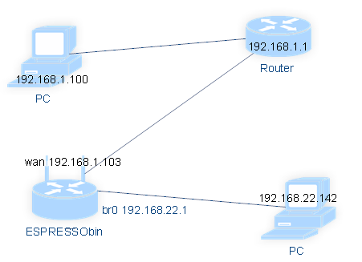

# ESPRESSObin

## 编译内核

### 下载编译器

[https://releases.linaro.org/components/toolchain/binaries/5.2-2015.11-2/aarch64-linux-gnu/gcc-linaro-5.2-2015.11-2-x86_64_aarch64-linux-gnu.tar.xz](https://releases.linaro.org/components/toolchain/binaries/5.2-2015.11-2/aarch64-linux-gnu/gcc-linaro-5.2-2015.11-2-x86_64_aarch64-linux-gnu.tar.xz)

### 下载内核代码

	git clone https://github.com/MarvellEmbeddedProcessors/linux-marvell
	git checkout linux-4.4.8-armada-17.02-espressobin

### 配置和编译内核(默认配置)

	make O=out ARCH=arm64 CROSS_COMPILE=aarch64-linux-gnu- mvebu_v8_lsp_defconfig
	make O=out ARCH=arm64 CROSS_COMPILE=aarch64-linux-gnu- -j8

### 编译内核支持ubuntu route

先看下拓扑图

使用下面内核配置

[ubuntu kenrel config](./ubuntu_config)

基本设置

网络配置使能联网下载软件包

	ifconfig eth0 up
	dhclient wan

安装相关的软件包

	apt-get update
	apt-get install bridge-utils samba dnsmasq-base iptables

开启路由(操作完成后就是一个gateway的角色)

	brctl addbr br0
	ifconfig eth0 0.0.0.0 up
	ifconfig wan 0.0.0.0 up
	ifconfig lan0 0.0.0.0 up
	ifconfig lan1 0.0.0.0 up
	brctl addif br0 lan0
	brctl addif br0 lan1
	ifconfig br0 192.168.22.1

	/etc/init.d/smbd stop
	/etc/init.d/smbd start

	dnsmasq --interface=br0 --dhcp-range=br0,192.168.22.2,192.168.22.199,12h
	echo 1 > /proc/sys/net/ipv4/ip_forward
	iptables -t nat -A POSTROUTING -o wan -j MASQUERADE
	dhclient wan

在开发板上测试是否设置成功ping google

	ping 8.8.8.8

将PC接入到开发部的lan口上,PC自动获取到了和br0在同一个网段的IP地址
在PC上测试是否能上网,能上网表示配置成功

## SD卡启动系统

查看SD卡状态(下面是笔者主机信息)

	lsblk
	NAME   MAJ:MIN RM   SIZE RO TYPE MOUNTPOINT
	sda      8:0    0 931.5G  0 disk
	├─sda1   8:1    0    50G  0 part
	├─sda2   8:2    0     1K  0 part
	├─sda5   8:5    0   673G  0 part /home
	├─sda6   8:6    0 517.7M  0 part /boot
	├─sda7   8:7    0   200G  0 part /
	└─sda8   8:8    0     8G  0 part [SWAP]
	sdb      8:16   1  14.9G  0 disk
	└─sdb1   8:17   1  14.9G  0 part

清除SD卡(这里假设是/dev/sdb)内所有数据,可以用lsblk查看SD卡状态

	sudo dd if=/dev/zero of=/dev/sdb bs=1M count=100

在SD上创建一个分区(sdb1)

	(echo n; echo p; echo 1; echo ''; echo ''; echo w) | sudo fdisk /dev/sdb

格式化分区为EXT4格式

	sudo mkfs.ext4 /dev/sdb1

把SD卡挂在到开发主机的/mnt/sdcard目录下

	sudo mkdir -p /mnt/sdcard
	sudo mount /dev/sdb1 /mnt/sdcard

将根文件系统(buildroot, ubuntu, yocto)解压到/mnt/sdcard/下(这里统一用rootfs.tar.gz表示)

	sudo tar -xvf rootfs.tar.gz -C /mnt/sdcard/

将内核和DTB拷贝到根文件系统的boot目录下

	sudo mkdir -p /mnt/sdcard/boot
	sudo cp Image /mnt/sdcard/boot/
	sudo cp marvell/armada-3720-community.dtb /mnt/sdcard/boot/

卸载SD卡

	sudo umount /mnt/sdcard

设置Uboot环境变量

	setenv image_name boot/Image
	setenv fdt_name boot/armada-3720-community.dtb
	setenv bootmmc 'mmc dev 0; ext4load mmc 0:1 $kernel_addr $image_name;ext4load mmc 0:1 $fdt_addr $fdt_name;setenv bootargs $console root=/dev/mmcblk0p1 rw rootwait; booti $kernel_addr - $fdt_addr'
	save

使用bootmmc启动开发板

	run bootmmc

## 根文件系统制作(Ubuntu 14.04)

[ubuntu-base-14.04-core-arm64.tar.gz下载地址](http://cdimage.ubuntu.com/ubuntu-base/releases/14.04/release/)

将ubuntu core解压到本地

	mkdir ubunturootfs
	sudo tar xzvf ubuntu-base-14.04-core-arm64.tar.gz -C ubunturootfs/

修改默认启动级别(etc/init/rc-sysinit.conf)

	DEFAULT_RUNLEVEL=3

去除root用户登录密码(etc/passwd)

	root::0:0:root:/root:/bin/bash

创建一个串口初始化配置文件(etc/init/ttyMV0.conf)

	start on stopped rc or RUNLEVEL=[12345]
	stop on runlevel [!12345]
	respawn
	exec /sbin/getty -L 115200 ttyMV0 vt100 -a root

将内核和DTB拷贝到根文件系统的boot目录下(制作好的文件系统就可以直接拷贝到SD卡中使用)

	cp Image boot/
	cp armada-3720-community.dtb boot/

## NFS服务器配置

安装必要的软件包

	apt-get install nfs-kernel-server

设置需要export的目录

	mkdir -p /espressobin_export/music

设置相关权限

	chmod -R 777 espressobin_export/
	chown -R nobody:nogroup espressobin_export/

绑定目录到NFS的路径

	mkdir /home/music
	mount --bind /home/music /espressobin_export/music

如果需要开机就bind的话在fstab里添加如下内容

	/home/music   /espressobin_export/music   none   bind   0   0

确认NFS服务器和客户端都在相同的域(/etc/idmapd.conf)
服务器和客户端都有下面内容

	[Mapping]
	Nobody-User = nobody
	Nobody-Group = nogroup

添加如下内容到/etc/exports

	/espressobin_export       192.168.1.0/24(rw,fsid=0,no_subtree_check,sync)
	/espressobin_export/music 192.168.1.0/24(rw,nohide,no_subtree_check,sync)

开启NFS

	exportfs -ra

每次有修改/etc/exports文件都要执行下面命令

	service nfs-kernel-server restart

在客户端(192.168.1.100)操作如下(192.168.1.103是NFS服务器,即开发板)
使用的是VERSION2,如果要使用VERSION4,需要配置开发板的NFS服务器

	sudo mount -t nfs -o nolock,vers=2 192.168.1.103:/espressobin_export/music /mnt

## Samba服务器搭建

### 安装samba

	apt-get update
	apt-get install samba

### 设置指定访问用户

	adduser espressobin
	smbpasswd -a espressobin
	smbpasswd -e espressobin

### 配置文件(/etc/samba/smb.conf)

	[myshare]
	comment = espressobin's share
	path = /home/espressobin
	valid users = root espressobin
	browseable = yes
	guest ok = no
	public = yes
	writable = yes
	printable = no
	create mask = 0765

### Linux客户端访问Samba服务器

	TBD

## 下载服务器搭建

### 安装aria2

	apt-get install aria2

### 创建相应的目录

	mkdir -p /etc/aria2/
	touch /etc/aria2/aria2.session
	chmod 777 /etc/aria2/aria2.session

### 添加配置文件(/etc/aria2/aria2.conf)

[aria2配置文件](./aria2.conf)

	chmod 777 aria2.conf

### 安装apache2

	apt-get install apache2

### 安装YAAW

	chmod 777 /var/www/html
	cd /var/www/html/
	git clone https://github.com/binux/yaaw.git /var/www/html

### 启动aria2c

	aria2c --conf-path=/etc/aria2/aria2.conf

### 在客户端连接该服务器测试

## miniDLNA服务器搭建

### 安装miniDLNA(ubuntu系统)

在源文件中添加下面内容(/etc/apt/sources.list)

	deb http://httpredir.debian.org/debian jessie main contrib non-free

安装(安装完后可以注释掉sources.list里的源,以免冲突)

	apt-get update
	apt-get install minidlna

### 配置miniDLNA(/etc/minidlna.conf)

配置文件内容如下

	network_interface=br0
	media_dir=A,/media/minidlna/Music
	media_dir=P,/media/minidlna/Pictures
	media_dir=V,/media/minidlna/Videos
	friendly_name=ESPRESSObin_dlna
	db_dir=/var/cache/minidlna
	log_dir=/var/log
	inotify=yes
	presentation_url=http://192.168.22.1:8200

创建必要的目录

	mkdir /media/minidlna
	mkdir /media/minidlna/Pictures
	mkdir /media/minidlna/Videos
	mkdir /media/minidlna/Music

重启miniDLNA服务和数据

	service minidlna restart
	service minidlna force-reload

### 配置开发板网络

	brctl addbr br0
	ifconfig eth0 0.0.0.0 up
	ifconfig wan 0.0.0.0 up
	ifconfig lan0 0.0.0.0 up
	ifconfig lan1 0.0.0.0 up
	brctl addif br0 lan0
	brctl addif br0 lan1
	ifconfig br0 192.168.22.1

	/etc/init.d/smbd stop
	/etc/init.d/smbd start

	dnsmasq --interface=br0 --dhcp-range=br0,192.168.22.2,192.168.22.199,12h
	echo 1 > /proc/sys/net/ipv4/ip_forward
	iptables -t nat -A POSTROUTING -o wan -j MASQUERADE
	dhclient wan

### 测试是否安装成功

在客户端输入br0的IP地址(192.168.22.1)和端口号进行访问
使用DLAN客户端软件(kodi)访问服务器

### 开机自启动miniDLNA

开启开机自启动服务

	update-rc.d minidlna defaults

如果出现下面的错误提示

	System start/stop links for /etc/init.d/minidlna already exist.

需要用enable选项

	update-rc.d minidlna enable

## 驱动开发

### 开发环境搭建(tftp)

笔者使用的开发主机是Gentoo Linux所以下面的配置针对Gentoo

安装tftp

	sudo emerge -v net-ftp/atftp

配置(/etc/conf.d/atftp)

	TFTPD_ROOT="/home/zeroway/ESPRESSObin"
	TFTPD_OPTS="--daemon --user nobody --group nobody"

开启tftp服务(服务器IP:192.168.1.100)

    /etc/init.d/atftp start

在开发板上使用tftp从服务器上下载文件

	apt-get install atftp
	atftp -g -r hello.ko 192.168.1.100

### 第一个驱动程序

[驱动源码在这里下载](./code/hello.c)

编译命令参考

	make ARCH=arm64 CROSS_COMPILE=/home/zeroway/ESPRESSObin/tool/gcc-linaro-5.2-2015.11-2-x86_64_aarch64-linux-gnu/bin/aarch64-linux-gnu- KERNEL_DIR=/home/zeroway/ESPRESSObin/src/kernel/linux-marvell-linux-4.4.8-armada-17.02-espressobin KERNEL_BUID_OUTPUT=/home/zeroway/ESPRESSObin/src/kernel/linux-marvell-linux-4.4.8-armada-17.02-espressobin/out

测试

	echo 8 8 8 8 > /proc/sys/kernel/printk
	insmod hello.ko
	rmmod hello

## 使用过程中遇到的问题和解决办法

Ubunt14.04网络配置

手动配置(开机不会在配置网络上卡吨)

	TBD

使用DHCP配置(添加下面内容到/etc/network/interfaces)

	auto wan
	iface wan inet dhcp

使用DHCP配置开机时配置始终不成功日志如下

	Waiting for network configuration...
	Waiting up to 60 more seconds for network configuration...
	Booting system without full network configuration...

进入系统后手动开启网卡,顺序不能颠倒,否则wan始终打不开

	ifconfig eth0 up
	ifconfig wan up

查看此时的路由表

	root@localhost:~# route
	Kernel IP routing table
	Destination     Gateway         Genmask         Flags Metric Ref    Use Iface
	default         192.168.1.1     0.0.0.0         UG    0      0        0 wan
	192.168.1.0     *               255.255.255.0   U     0      0        0 wan
